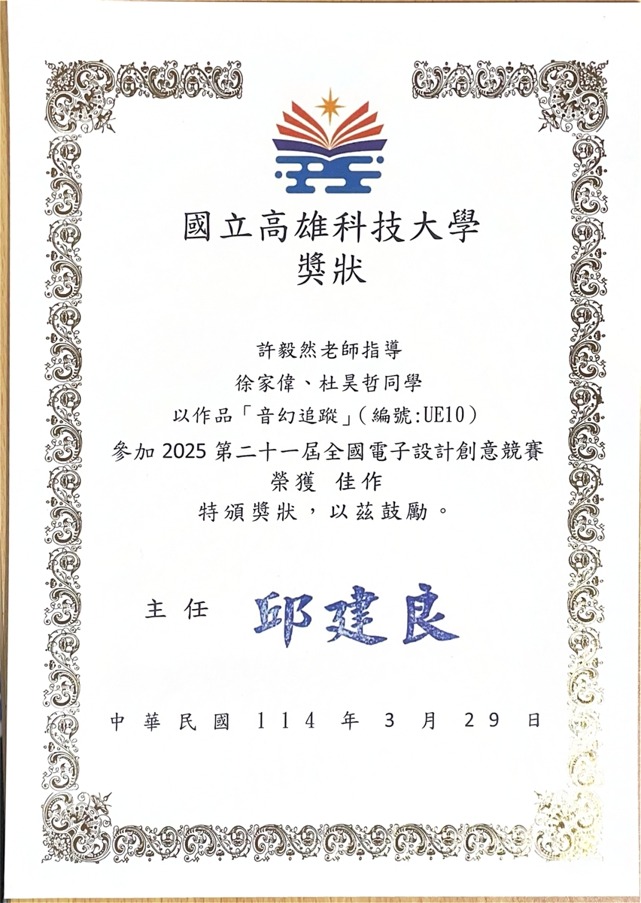
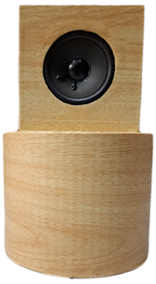
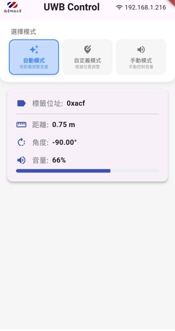
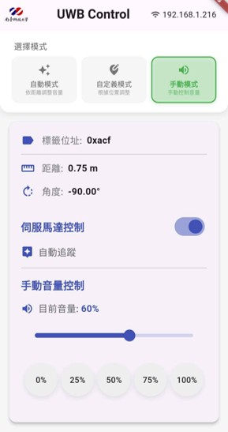

# 音幻追蹤

第21屆全國電子設計創意競賽作品 - 佳作獲獎



## 專案簡介

音幻追蹤是一個基於UWB（Ultra-Wideband）定位技術的追蹤音響系統以及可對其調控的手機APP，系統能夠透過UWB標籤得知使用者位置，並自動調整音響角度和音量，提供最佳的聆聽體驗。


## 主要功能

- **自動模式**：系統自動偵測使用者位置並調整音響- 
- **自定義模式**：可儲存常用位置設定，快速切換
- **手動模式**：使用者可以手動控制音響角度和音量
 


## 系統架構

```
音幻追蹤/
├── backend/          # Python Flask 後端服務
├── mobile_app/       # Flutter 移動應用程式
├── docs/            # 文件和圖片
└── README.md        # 專案說明
```

## 技術特色

- UWB定位技術實現精確定位
- 伺服馬達控制音響角度
- 智慧音量調節算法
- Flutter跨平台移動應用
- Flask RESTful API後端


## 硬體需求

- Raspberry Pi 4
- UWB定位模組
- 伺服馬達
- 音響系統

## 獲獎紀錄

🏆 第21屆全國電子設計創意競賽 - 佳作

## 專案成員

- 指導老師：[許毅然]
- 組員：杜昊哲 徐家偉

本專案採用 MIT 授權條款。

## 聯絡資訊

如有任何問題或建議，歡迎聯絡開發團隊。
